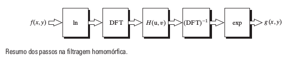
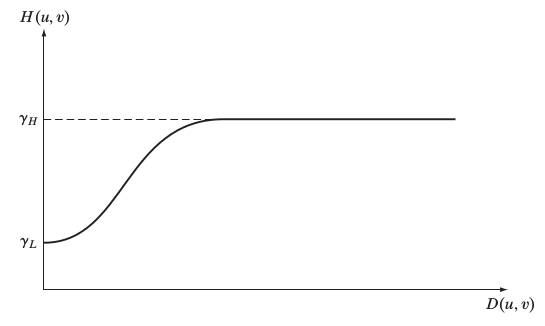
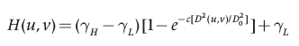
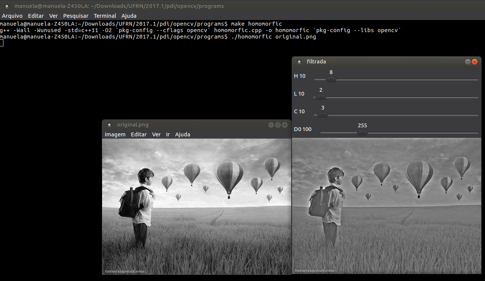
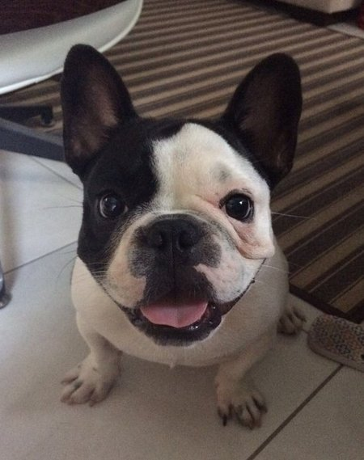
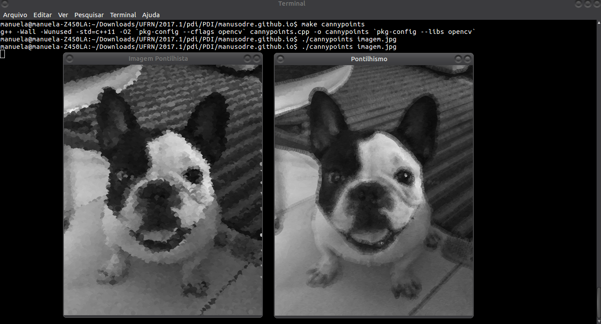

= ATIVIDADES PROCESSAMENTO DIGITAL DE IMAGENS

[.text-center]
== ATIVIDADES UNIDADE 1:

=== 3.2 - EXERCÍCIO:

==== Regiões:

[.text-left]  
  Utilizando o programa exemplos/pixels.cpp como referência, implemente um programa regions.cpp. Esse programa deverá solicitar ao usuário as coordenadas de dois pontos P1P1 e P2P2 localizados dentro dos limites do tamanho da imagem e exibir que lhe for fornecida. Entretanto, a região definida pelo retângulo de vértices opostos definidos pelos pontos P1P1 e P2P2 será exibida com o negativo da imagem na região correspondente. O efeito é ilustrado na Figura Regiões.

[.text-center]
=== SOLUÇÃO:

[.text-center]
== ATIVIDADES UNIDADE 2:
:stem: latexmath

[.text-center]
== FILTRAGEM NO DOMÍNIO DA FREQUÊNCIA

[.text-center]
=== 8.2 - EXERCÍCIO:

[.text-left]
	Utilizando o programa exemplos/dft.cpp como referência, implemente o filtro homomórfico para melhorar imagens com iluminação irregular. Crie uma cena mal iluminada e ajuste os parâmetros do filtro homomórfico para corrigir a iluminação da melhor forma possível. Assuma que a imagem fornecida é em tons de cinza.

[.text-center]
=== SOLUÇÃO:

[.text-center]
**Filtragem Homomórfica**
[.text-left]
A filtragem homomórfica trata-se basicamente de uma abordagem que opera sobre as componentes de iluminação e reflectância separadamente. Em que ela atenua as baixas-frequências e realça as altas. 

Como mostrado na equação abaixo:

[.text-center]
stem:[f(x,y)=i(x,y)r(x,y)]
[.text-left]
Em que esse método de filtragem é deduzido na seguinte imagem:

[.text-left]
O filtro homomórfico funciona com a idéia de que a "iluminação" é a componente de baixa-frequência e a "reflectância" é a componente de alta-frequência. Onde aumenta-se o contraste se a iluminação é diminuida (i<1) e a reflectância é aumentada (r>1). 
Nessa transição pode-se utilizar qualquer curva, mas geralmente utiliza-se Butterworth ou Gaussiano. 

[.text-left]
Podemos ver na figura abaixo um corte transversal de um filtro como esse. 

[.text-left]
E logo abaixo temos também uma forma ligeiramente modificada do filtro passa-alta gaussiano.

[.text-left]
Abaixo temos o código de implementação do filtro:

.homomorfic.cpp

[source,cpp,numbered]
[.text-left]

----

#include <iostream>
#include <opencv2/opencv.hpp>
#include <opencv2/imgproc/imgproc.hpp>
#include <math.h>

#define RADIUS 20

using namespace cv;
using namespace std;

Mat filter, tmp;
int dft_N, dft_M;
int dh_slider = 20;
int dh_slider_max = 100;

int dl_slider = 5;
int dl_slider_max = 100;

int c_slider = 5;
int c_slider_max = 100;

int d0_slider = 80;
int d0_slider_max = 1000;

char TrackbarName[50];

void slider(int, void*){
	int M,N;
	float D2, dh, dl, d0;
	M = dft_M;
	N = dft_N;
	dh = dh_slider/10.0;
	dl = dl_slider/10.0;
	d0 = d0_slider/10.0;
  //calculando o filtro homomorfico a partir do ajuste dos sliders da trackbar. 
	tmp = Mat(dft_M, dft_N, CV_32F);
	for(int i=0; i<dft_M ;i++)
		for(int j=0; j<dft_N ;j++){
				D2 = ((float)i-M/2.0)*((float)i-M/2.0) + ((float)j-N/2.0)*((float)j-N/2.0);
				tmp.at<float>(i,j) = (dh-dl)*(1.0-exp(-1.0*(float)c_slider*(D2/(d0*d0))))+ dl;
			}
	
  // cria a matriz com as componentes do filtro e junta
  // ambas em uma matriz multicanal complexa
  Mat comps[]= {tmp, tmp};
  merge(comps, 2, filter);

}

// troca os quadrantes da imagem da DFT
void deslocaDFT(Mat& image ){
  Mat A, B, C, D;

  // se a imagem tiver tamanho impar, recorta a regiao para
  // evitar cópias de tamanho desigual
  image = image(Rect(0, 0, image.cols & -2, image.rows & -2));
  int cx = image.cols/2;
  int cy = image.rows/2;
  
  // reorganiza os quadrantes da transformada
  // A B   ->  D C
  // C D       B A
  A = image(Rect(0, 0, cx, cy));
  B = image(Rect(cx, 0, cx, cy));
  C = image(Rect(0, cy, cx, cy));
  D = image(Rect(cx, cy, cx, cy));

  // A <-> D
  A.copyTo(tmp);  D.copyTo(A);  tmp.copyTo(D);

  // C <-> B
  C.copyTo(tmp);  B.copyTo(C);  tmp.copyTo(B);
}

int main(int argc , char** argv){
  VideoCapture cap;   
  Mat imaginaryInput, complexImage, multsp;
  Mat padded, mag;
  Mat image, imagegray; 
  Mat_<float> realInput, zeros;
  vector<Mat> planos;

  // guarda tecla capturada
  char key;
	if(argc != 2){
		printf("ERRO\n");
		exit(-1);
	}
	image = imread(argv[1],CV_LOAD_IMAGE_GRAYSCALE); // carrega a imagem

	cv::log(realInput, realInput);
  // identifica os tamanhos otimos para calculo da FFT
  dft_M = getOptimalDFTSize(image.rows);
  dft_N = getOptimalDFTSize(image.cols);

  // realiza o padding da imagem
  copyMakeBorder(image, padded, 0,
                 dft_M - image.rows, 0,
                 dft_N - image.cols,
                 BORDER_CONSTANT, Scalar::all(0));
	
  // parte imaginaria da matriz complexa (preenchida com zeros)
  zeros = Mat_<float>::zeros(padded.size());

  // prepara a matriz complexa para ser preenchida
  complexImage = Mat(padded.size(), CV_32FC2, Scalar(0));

  filter = complexImage.clone();	
	slider(1,0);
	
  for(;;){

    planos.clear();

    realInput = Mat_<float>(padded); 

    planos.push_back(realInput);
    planos.push_back(zeros);

    merge(planos, complexImage);

    dft(complexImage, complexImage);

    deslocaDFT(complexImage);

    mulSpectrums(complexImage,filter,complexImage,0);

    deslocaDFT(complexImage);

    idft(complexImage, complexImage);

    planos.clear();

  
    split(complexImage, planos);

    normalize(planos[0], planos[0], 0, 1, CV_MINMAX);
		// calcula a exponencial da imagem
		cv::exp(planos[0], planos[0]);

    normalize(planos[0], planos[0], 0, 1, CV_MINMAX);
    imshow("filtrada", planos[0]);

		key = (char) waitKey(10);
    if( key == 27 ) break; // esc pressed!
 
  	sprintf( TrackbarName, "H %d", dh_slider_max/10);
  	createTrackbar( TrackbarName, "filtrada",
				  &dh_slider,
				  dh_slider_max,
				  NULL); //funcao

		sprintf( TrackbarName, "L %d", dl_slider_max/10);
  	createTrackbar( TrackbarName, "filtrada",
				  &dl_slider,
				  dl_slider_max,
				  NULL); //funcao

		sprintf( TrackbarName, "C %d", c_slider_max/10);
  	createTrackbar( TrackbarName, "filtrada",
				  &c_slider,
				  c_slider_max,
				  NULL); //funcao

		sprintf( TrackbarName, "D0 %d", d0_slider_max/10);
  	createTrackbar( TrackbarName, "filtrada",
				  &d0_slider,
				  d0_slider_max,
				  NULL); //funcao 

		slider(d0_slider,0);
  }
  return 0;
}
----

[.text-left]
Abaixo mostramos a imagem original e ao lado a imagem com o filtro homomórfico aplicado. 

=== 11.1 - EXERCÍCIO:
[.text-left]

  * Utilizando os programas exemplos/canny.cpp e exemplos/pontilhismo.cpp como referência, implemente um programa cannypoints.cpp.
  A idéia é usar as bordas produzidas pelo algoritmo de Canny para melhorar a qualidade da imagem pontilhista gerada. A forma como a informação de borda será usada é livre. Entretanto, são apresentadas algumas sugestões de técnicas que poderiam ser utilizadas: 
  ** Desenhar pontos grandes na imagem pontilhista básica;
  ** Usar a posição dos pixels de borda encontrados pelo algoritmo de Canny para desenhar pontos nos respectivos locais na imagem gerada.
  ** Experimente ir aumentando os limiares do algoritmo de Canny e, para cada novo par de limiares, desenhar círculos cada vez menores nas posições encontradas. A Figura Pontilhismo aplicado à imagem Lena foi desenvolvida usando essa técnica.
  * Escolha uma imagem de seu gosto e aplique a técnica que você desenvolveu.
  * Descreva no seu relatório detalhes do procedimento usado para criar sua técnica pontilhista.

[.text-center]
=== SOLUÇÃO:
[.text-left]
O algoritmo de Canny de fato é útil para diversas aplicações em processamento de imagens e visão artificial. Informações de bordas podem ser usadas para melhorar algoritmos de segmentação automática ou para encontrar objetos em cenas e pontos de interesse. O pontilhismo é uma técnica de desenho impressionista onde o quadro é pintado usando apenas pontos.
[.text-left]
Nesta atividade o objetivo era o desenvolvimento do filtro de Canny para gerar uma imagem com pontilhismo. Em que inicialmente foi aplicado na imagem o processo do pontilhismo, e em seguida, a imagem bruta passou por algumas iterações do filtro de Canny, para que fosse possível delimitar suas bordas. Em cada uma das iterações o limiar do filtro é alterado com a intenção de obter uma imagem com menos bordas. Para as bordas ficarem mais destacadas foi necessário percorrer a imagem filtrada e desenhar um círculo em cada pixel que possuísse um tom de cinza maior que zero. E como saída é gereda e salva duas imagens editadas, onde a primeira(Imagem pontilhista.jpg) é a imagem com efeito de pontilhismo aplicado. 

.cannypoints.cpp

[source,cpp,numbered]
[.text-left]

----

  #include <iostream>
  #include <opencv2/opencv.hpp>
  #include <fstream>
  #include <iomanip>
  #include <vector>
  #include <algorithm>
  #include <numeric>
  #include <ctime>
  #include <cstdlib>

  using namespace std;
  using namespace cv;

  #define STEP 5
  #define JITTER 3
  #define RAIO 5

  int main(int argc, char** argv){
  Mat Original, borderOriginalImage;
  Mat Pontilhismo;
  int x, y, width, height, gray;
  //arrays de índices que servirão para identificar elementos da imagem de referência
  vector<int> yrange;
  vector<int> xrange;

  srand(time(0));

  Original= imread("imagem.jpg" ,CV_LOAD_IMAGE_GRAYSCALE);

  width = Original.size().width;
  height = Original.size().height;
  xrange.resize(height/STEP);
  yrange.resize(width/STEP);
  iota(xrange.begin(), xrange.end(), 0);
  iota(yrange.begin(), yrange.end(), 0);

  for(uint i=0; i<xrange.size(); i++){
    xrange[i]= xrange[i]*STEP+STEP/2;
  }

  for(uint i=0; i<yrange.size(); i++){
    yrange[i]= yrange[i]*STEP+STEP/2;
  }

  Original.copyTo(Pontilhismo);

  //Executa o pontilhismo;
  for(auto i : xrange){
    random_shuffle(yrange.begin(), yrange.end());
    for(auto j : yrange){
      x = i+rand()%(2*JITTER)-JITTER+1;
      y = j+rand()%(2*JITTER)-JITTER+1;
      gray = Original.at<uchar>(x,y);
      circle(Pontilhismo, cv::Point(y,x), RAIO, CV_RGB(gray,gray,gray), -1, CV_AA);
    }
  }

  imshow("Imagem Pontilhista", Pontilhismo);
  imwrite("imagemComPontilhismo.jpg", Pontilhismo);

   //Aplica Canny
   for(int z=0; z<5; z++){
     Canny(Original, borderOriginalImage, 10*z, 50*z);
     int raio = 5-z;

     for(int i=0; i<height; i++ ){
        for(int j=0; j<width; j++){
           if(borderOriginalImage.at<uchar>(i,j) == 255){
              gray = Original.at<uchar>(i,j);
              circle(Pontilhismo, cv::Point(j,i), raio, CV_RGB(gray,gray,gray), -1, CV_AA);
             }
        }
    }
    
    
  }
  imshow("Pontilhismo", Pontilhismo);
  imwrite("imagemComPontilhismo.jpg", Pontilhismo);
 

   waitKey();
  return 0;
}

----

Para esta aplicação foi utilizada como entrada, a imagem abaixo:

.Imagem de entrada para aplicação do algoritmo

E como saída foi obtida a imagem abaixo:

